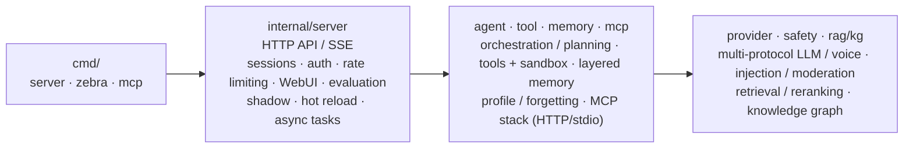

# Zebra AI Agent

**English** | [简体中文](README.md)

<p align="left">
 <a href="https://github.com/ericthz/zebra/actions/workflows/ci.yml"></a>
 
 
 
 
</p>

**Reimplement every AI Agent building block from scratch in the smallest readable pure Go — understand the principles, not just how to call an SDK.**

1. **Pure Go standard library, zero third-party runtime dependencies** — no framework or SDK, the code *is* the principle.
2. **Each capability = a minimal runnable implementation + in-depth source comments (why / how / how it evolves in production) + unit tests + end-to-end verification**.
3. **Committed one feature at a time**: one feature per commit, so every capability's evolution can be traced with `git log`.

> Note: this is not a product you can ship as-is — it is a **"capability → principle → code" reference map**.

<p align="left"></p>
<p align="left"></p>
<p align="left"><em>Zebra Web workbench (top) and Zebra terminal CLI (bottom)</em></p>

---

## Contents

- [1. Project Overview and Reading Guide](#1-project-overview-and-reading-guide)
- [2. Quick Start](#2-quick-start)
- [3. Configuration and Environment Variables](#3-configuration-and-environment-variables)
- [4. API Reference](#4-api-reference)
- [5. AI Agent Capability Map](#5-ai-agent-capability-map)
- [6. Architecture](#6-architecture)
- [7. Engineering and Quality Assurance](#7-engineering-and-quality-assurance)
- [8. License](#8-license)

## 1. Project Overview and Reading Guide

### 1.1 Positioning

Built for developers who want to **genuinely understand how an AI Agent works internally**: not "I can use some SDK", but "I know what happens inside the Agent, why it is designed this way, and what would change if it were done differently".

### 1.2 Baseline

| Dimension | Status |
|---|---|
| Code size | 193 `.go` files (87 of them tests), ~26.5k lines |
| Packages | 3 entrypoints (`cmd/`) + 27 packages (`internal/`) + evaluation cases (`test/eval/`) |
| Runtime dependencies | Zero third-party, pure Go standard library |
| Quality gates | `go build` / `go vet` with zero warnings, `go test ./...` all green; CI workflow in [7. Engineering and Quality Assurance](#7-engineering-and-quality-assurance) |
| Coverage | Every mainstream AI Agent building block (see [5. AI Agent Capability Map](#5-ai-agent-capability-map)) |

### 1.3 How to Read

> To learn systematically, read [5. AI Agent Capability Map](#5-ai-agent-capability-map) top to bottom, block by block —
> for each building block, read the "one-line principle" first, then open the file in the "Code entry"
> column and read its header comment, and finally change one thing and watch the behaviour. The
> passive browsing path is:

1. Pick a building block you want to learn from [5. AI Agent Capability Map](#5-ai-agent-capability-map);
2. Open the file in the "Code entry" column and **read the header comment first** (every header comment follows "why → how → how it evolves in production");
3. Run that package's tests and observe the behaviour: `go test ./internal/<pkg>/ -v`;
4. Experience it end to end through the CLI / HTTP endpoint (see [2. Quick Start](#2-quick-start));
5. For a full pass: use `git log --oneline` and walk `git show <commit>` in commit order to see how each capability went from zero to one.

---

## 2. Quick Start

### 2.1 Prerequisites

- Go 1.26.5+ (matching the declaration in `go.mod`; pure standard library, no third-party dependencies)
- Ollama (local LLM and embeddings, optional; an OpenAI-compatible gateway also works)

### 2.2 Local CLI

```bash
ollama pull qwen3.5:0.8b-mlx
go run ./cmd/zebra
# Input: what is the weather in Beijing today? → watch tool calls, skill injection and RAG retrieval
# Multimodal: go run ./cmd/zebra -image ./photo.png -image https://example.com/b.jpg
# Input: how are these two images related? → the model answers after seeing the images (available in every mode)
```

The CLI and the server share the **same assembly logic**: `.env` is loaded automatically, MCP tools
are mounted when `MCP_MODE` is set, long-term memory is enabled when a usable `QDRANT_URL` or
`REDIS_URL` is present, and the `docs/` knowledge base is loaded; anything not ready degrades
gracefully instead of blocking startup. Diagnostic logs are written to `zebra.log` (`ZEBRA_LOG=off`
falls back to stderr); the terminal only shows the manifest and the conversation.

Like the Web UI, the Zebra CLI supports **several conversation modes** (the `-mode` startup flag, or
`/mode <name>` at runtime): `chat` plain conversation, `plan` plan-and-execute, `react` ReAct
reasoning-and-acting, `reflect` self-reflection, `debate` two-agent debate, `supervisor` multi-agent
routing (three specialised workers for data / knowledge / general requests), and `consistent`
self-consistency sampling (sample several answers independently, then let the model pick the best,
reducing single-shot randomness; `SELF_CONSISTENT_SAMPLES` controls the sample count). Execution is
shown as a terminal activity trace: `◇` phases (planning / steps / thinking / observation), `▲` tool
calls (with success or failure), `■` skill injection — matching the activity blocks in the Web UI one
to one. `/help` lists every command.

### 2.3 HTTP Server

```bash
export ADMIN_KEY=your-admin-key # see 3.4 Service and Security; omit when bound to 127.0.0.1, a default is used
go run ./cmd/server
# In another terminal:
curl -X POST :8080/v1/chat \
 -H "Authorization: Bearer $ADMIN_KEY" \
 -H "Content-Type: application/json" \
 -d '{"message":"what is the weather in Beijing today?","confirm_risky":true}'
```

The server's JSON logs are **written twice**, to stdout and to `server.log` (`LOG_FILE` overrides the
path, `LOG_FILE=off` disables writing to disk).

### 2.4 One-Command Full Stack

```bash
docker compose up --build
```

### 2.5 Standalone MCP Server

```bash
make build # produces bin/zebra-mcp
go run ./cmd/mcp -http :9000 # HTTP mode
# or stdio mode: set MCP_MODE=stdio + MCP_COMMAND=bin/zebra-mcp in .env
```

### 2.6 Quick Self-Check

```bash
go build ./... && go vet ./... && go test ./...
curl :8080/healthz # ok
curl :8080/readyz # ready
```

---

## 3. Configuration and Environment Variables

All configuration is injected through environment variables; `.env` in the working directory is loaded
automatically at startup (real environment variables win, `.env` only fills in what is unset).
[`.env.example`](.env.example) is the template; the `/env` command (CLI and Web UI) lists the
effective value and default of every configuration key, and the full key table lives in
`internal/observe/env.go`.

### 3.1 Model and Fault Tolerance

| Variable | Default | Description |
|---|---|---|
| `OLLAMA_BASE_URL` / `OLLAMA_MODEL` | `http://localhost:11434` / `qwen3.5:0.8b-mlx` | Primary model (native Ollama, streaming supported) |
| `FALLBACK_BASE_URL` / `FALLBACK_MODEL` | empty | OpenAI-compatible fallback model (used when the primary fails) |
| `ANTHROPIC_API_KEY` / `ANTHROPIC_MODEL` / `ANTHROPIC_BASE_URL` | empty | Optional Anthropic fallback |
| `OPENAI_API_KEY` / `OPENAI_BASE_URL` | empty | OpenAI-compatible gateway (shared by fallback / embeddings / voice) |
| `EMBED_MODEL` / `OPENAI_EMBED_MODEL` | `nomic-embed-text:v1.5` / `text-embedding-3-small` | Embedding model names |
| `HTTP_TIMEOUT` | `60` | LLM request timeout (seconds) |
| `HTTP_RETRIES` / `HTTP_BACKOFF_MS` | `1` / `300` | Retry count / backoff base (milliseconds) |
| `CIRCUIT_THRESHOLD` / `CIRCUIT_COOLDOWN_SEC` | `5` / `30` | Consecutive failures that open the circuit / cooldown before recovery (seconds) |

### 3.2 Agent Execution Parameters

| Variable | Default | Description |
|---|---|---|
| `REACT_MAX_STEPS` | `6` | Maximum ReAct reasoning-and-acting steps (aborts with an error if it has not converged) |
| `SELF_CONSISTENT_SAMPLES` | `3` | Number of self-consistency samples (`consistent` mode) |
| `CONTEXT_MAX_TOKENS` | `4000` | Context-window token budget (trimmed with a sliding window when exceeded) |
| `SUMMARY_MAX_CHARS` | `600` | Maximum characters of the conversation summary |
| `MAX_TOOL_TURNS` | `5` | Maximum tool-calling rounds |
| `ZEBRA_SUMMARIZER` | `truncate` | Summary compressor: `truncate` / `llm` (LLM-based semantic compression) |
| `ZEBRA_QUERY_REWRITE` | `0` | `1` enables RAG query rewriting (better retrieval hit rate) |

### 3.3 Knowledge Base and Retrieval

| Variable | Default | Description |
|---|---|---|
| `RAG_CHUNK_SIZE` / `RAG_CHUNK_OVERLAP` | `600` / `100` | Document chunk size / overlap between chunks (characters) |
| `ZEBRA_RAG_RERANK` | `0` | `1` enables post-retrieval LLM reranking |

### 3.4 Service and Security

| Variable | Default | Description |
|---|---|---|
| `ADDR` | `:8080` | Listen address. Refuses to start when bound to a non-loopback address with no key configured (prevents default-key exposure) |
| `ADMIN_KEY` / `USER_KEY` | `admin-key` / `user-key` | Two-level RBAC API keys. Defaults are only allowed when bound to 127.0.0.1/localhost; otherwise they must be set explicitly |
| `ZEBRA_LOG` | `zebra.log` | Zebra CLI diagnostic log path (`off` = stderr) |
| `LOG_FILE` | `server.log` | Server dual-write log path (`off` = stdout only) |
| `MCP_MODE` / `MCP_COMMAND` / `MCP_HTTP_URL` / `MCP_HTTP_TOKEN` | empty | Remote MCP tools (stdio/http; stdio should point at the prebuilt `bin/zebra-mcp`; setting a token requires Bearer auth) |
| `WEBHOOK_URL` / `WEBHOOK_SECRET` | empty | Outbound webhook notifications (HMAC-signed) |

### 3.5 Local Execution Sandbox

| Variable | Default | Description |
|---|---|---|
| `EXEC_WORKDIR` | `workspace` | Sandbox working-directory allowlist |
| `EXEC_READONLY` | `1` | 1 = read-only (no file writes, no command execution) |

### 3.6 Semantic Cache

| Variable | Default | Description |
|---|---|---|
| `CACHE_MAX_ENTRIES` | `200` | Maximum number of semantic cache entries |
| `CACHE_THRESHOLD` | `0.92` | Semantic cache hit threshold (0-1) |

### 3.7 Memory and Profile

| Variable | Default | Description |
|---|---|---|
| `QDRANT_URL` / `QDRANT_COLLECTION` | empty / `zebra_mem` | Vector long-term memory (degrades automatically when unavailable) |
| `EMBED_VECTOR_SIZE` | `768` | Embedding vector size (must match the embedding model) |
| `REDIS_URL` / `REDIS_PASSWORD` / `REDIS_DB` | empty / empty / `0` | Session / async task / long-term memory scaling (when Qdrant is absent) |
| `PROFILE_TTL_HOURS` | `720` | Profile fact freshness (hours; 30 days by default) |
| `PROFILE_LLM` | `1` | Profile extraction: 1 = LLM with rule fallback, 0 = rules only |
| `PROFILE_SWEEP_MINUTES` | `60` | Profile expiry sweep interval (minutes) |

### 3.8 Evaluation and Shadow

| Variable | Default | Description |
|---|---|---|
| `EVAL_CASES_DIR` | `test/eval/cases` | Offline evaluation case directory (feedback is recirculated here) |
| `ZEBRA_SHADOW_MODEL` | empty | Shadow-evaluation candidate model (setting it turns the feature on) |
| `ZEBRA_SHADOW_OPENAI` / `ZEBRA_SHADOW_BASE_URL` | `0` / empty | Candidate uses an OpenAI-compatible backend / candidate gateway address |
| `ZEBRA_SHADOW_SAMPLE` / `SHADOW_STORE_MAX` | `10` / `200` | Automatic sampling percentage (0 = explicit triggers only) / record cap |
| `JUDGE_BASE_URL` / `JUDGE_OPENAI` / `JUDGE_MODEL` / `JUDGE_API_KEY` | empty / `0` / empty / empty | Independent judge model; when all are empty the production router is reused |

### 3.9 Voice

| Variable | Default | Description |
|---|---|---|
| `VOICE_BASE_URL` / `VOICE_API_KEY` | empty | OpenAI-compatible voice gateway (setting it enables ASR/TTS) |
| `VOICE_ASR_MODEL` / `VOICE_TTS_MODEL` | `whisper-1` / `tts-1` | Transcription / synthesis models |
| `VOICE_TONE` | `alloy` | Synthesis voice |

> Coloured output follows the `NO_COLOR` convention: it is disabled when `NO_COLOR` is set, when `TERM=dumb`, or when the output is not a TTY (pipe / redirect / CI).

---

## 4. API Reference

### 4.1 Endpoints

| Method | Path | Description | Auth |
|---|---|---|---|
| POST | `/v1/chat` | Non-streaming chat (`mode`: `plan` / `supervisor` / `reflect` / `react` / `debate` / `consistent`) | user |
| POST | `/v1/chat/stream` | SSE streaming chat | user |
| DELETE | `/v1/user/data` | Right to be forgotten: delete all of the current user's data | user |
| GET | `/v1/user/profile` | View profile facts and conflict records | user |
| POST | `/v1/user/profile/forget` | Delete a single profile fact | user |
| POST | `/v1/user/profile/resolve` | Resolve a profile conflict (`keep: old/new`) | user |
| POST | `/v1/tasks` | Submit an async long-running task (returns an id immediately) | user |
| GET | `/v1/tasks` | Task list | user |
| GET | `/v1/tasks/{id}` | Task detail / progress / checkpoints | user |
| POST | `/v1/feedback` | Submit feedback (thumbs up/down + comment; a thumbs-down flows back into the eval set) | user |
| GET | `/v1/feedback` | My feedback list with positive/negative counts | user |
| GET | `/v1/knowledge` | Knowledge graph query (`?entity=xxx`) | user |
| POST | `/v1/admin/reload` | Hot-reload skills / prompts / knowledge base / plugins | admin |
| POST | `/v1/eval/shadow` | Trigger one shadow evaluation (returns the comparison synchronously) | admin |
| GET | `/v1/eval/shadow` | Shadow evaluation records | admin |
| GET | `/v1/eval/shadow/stats` | Shadow dashboard + canary switch recommendation | admin |
| POST | `/v1/eval/shadow/promote` | Promote the candidate model to primary (auto-rolls back on quality regression) | admin |
| POST | `/v1/voice/chat` | Full voice pipeline (audio → text → Agent → audio, base64) | user |
| POST | `/v1/voice/transcribe` | Speech-to-text (multipart upload) | user |
| POST | `/v1/voice/synthesize` | Text-to-speech | user |
| GET | `/healthz` `/readyz` | Liveness / readiness probes | none |
| GET | `/metrics` | Prometheus metrics | none |
| GET | `/metrics/cost` | Cost attribution (with per-user / per-session breakdown) | admin |
| GET | `/favicon.svg` | Site icon | none |
| GET | `/` | Zero-build Web UI (SSE chat) | none |

### 4.2 Chat Examples

> The examples below use `$ADMIN_KEY` / `$USER_KEY` for the two API keys from [3.4 Service and Security](#34-service-and-security); for local demos bound to 127.0.0.1 with nothing configured, the defaults are `admin-key` / `user-key`.

```bash
# Plain chat (the user role exposes only a subset of tools)
curl -X POST :8080/v1/chat \
 -H "Authorization: Bearer $USER_KEY" -H "Content-Type: application/json" \
 -d '{"message":"what is 12*8?"}'

# Streaming chat (SSE)
curl -N -X POST :8080/v1/chat/stream \
 -H "Authorization: Bearer $ADMIN_KEY" -H "Content-Type: application/json" \
 -d '{"message":"tell me about the weather in Beijing and Shanghai","stream":true}'

# Multi-turn: create a session to get a session_id, then continue it
curl -X POST :8080/v1/chat \
 -H "Authorization: Bearer $ADMIN_KEY" -H "Content-Type: application/json" \
 -d '{"message":"my name is Xiaoming"}'
curl -X POST :8080/v1/chat \
 -H "Authorization: Bearer $ADMIN_KEY" -H "Content-Type: application/json" \
 -d '{"session_id":"<returned in the previous step>","message":"what is my name?"}'
```

### 4.3 Advanced Capabilities

```bash
# Six reasoning modes (plan / supervisor / reflect / react / debate / consistent)
curl -X POST :8080/v1/chat -H "Authorization: Bearer $ADMIN_KEY" -H "Content-Type: application/json" \
 -d '{"message":"compute (23+19)*5 and tell me the date today","mode":"plan"}'
curl -X POST :8080/v1/chat -H "Authorization: Bearer $ADMIN_KEY" -H "Content-Type: application/json" \
 -d '{"message":"what is the weather in Beijing?","mode":"react"}'
curl -X POST :8080/v1/chat -H "Authorization: Bearer $ADMIN_KEY" -H "Content-Type: application/json" \
 -d '{"message":"what is the weather in Beijing?","mode":"consistent"}'

# Shadow dashboard / promote / automatic rollback (admin only)
curl :8080/v1/eval/shadow/stats -H "Authorization: Bearer $ADMIN_KEY"
curl -X POST :8080/v1/eval/shadow/promote -H "Authorization: Bearer $ADMIN_KEY"

# Knowledge graph: look up relations by entity
curl ":8080/v1/knowledge?entity=tool-calling" -H "Authorization: Bearer $USER_KEY"

# Voice chat (multipart file = audio)
curl -X POST :8080/v1/voice/chat -H "Authorization: Bearer $USER_KEY" -F "file=@voice.wav"

# Multimodal: ask a question with images (images accepts http(s) URLs / data: URIs)
curl -X POST :8080/v1/chat -H "Authorization: Bearer $USER_KEY" -H "Content-Type: application/json" \
 -d '{"message":"what is in this image?","images":["https://example.com/photo.png"]}'

# Profile: view / fine-grained forget / conflict resolution
curl :8080/v1/user/profile -H "Authorization: Bearer $USER_KEY"
curl -X POST :8080/v1/user/profile/resolve -H "Authorization: Bearer $USER_KEY" \
 -d '{"key":"name","keep":"old"}'
```

**Auth and rate-limiting, hands on**: no `Authorization` → 401; a high call rate → 429; calling
`web_search` with the `user` role → tool execution error (the allowlist revokes the permission).

---

## 5. AI Agent Capability Map

> This table is the heart of the repository: **capability → code entry → one-line principle**.
> It is organised by capability domain, covering the four areas of engineering delivery: **service delivery and access**, **reliability engineering**, **Agent capability completion**, and **security and compliance**; for engineering and testing, see [7. Engineering and Quality Assurance](#7-engineering-and-quality-assurance).
> The header comment of every entry file is that capability's "principle lecture".

### 5.1 Conversation and Reasoning

| Capability | Code entry | One-line principle |
|---|---|---|
| Tool-calling loop | `internal/agent/agent.go` | The model requests a tool → execute it → feed the result back → call again, until it emits plain text |
| Parallel tool calls | `internal/agent/agent.go` | Tools in the same round that do not depend on each other run concurrently; results are fed back in call order, so nothing is reordered |
| Argument repair / loop detection | `internal/agent/agent.go` | Failed argument parsing is reported back for retry; repeated identical calls are detected as an infinite loop and aborted |
| Plan-and-execute | `internal/agent/plan.go` | Break the task into steps (JSON) first, then execute them one by one; sub-steps are not written to history |
| ReAct trace | `internal/agent/react.go` | Each step emits a thought/action/answer triple; tool observations are fed back and it continues |
| Reflection | `internal/agent/reflect.go` | After generating, let the model critique and improve; falls back to the original on failure |
| Self-consistency | `internal/agent/reflect.go` | Sample several answers independently and pick the best, reducing single-shot randomness |
| Multi-agent Supervisor | `internal/supervisor/` | LLM routing with a keyword fallback; specialised workers each mind their own domain |
| Multi-agent debate | `internal/agent/debate.go` | Two opposing stances answer independently → exchange views → a judge picks the winner |
| Strict structured output | `internal/schema/` `internal/provider/structured.go` | `response_format` before generation plus schema validation afterwards — a double safeguard |

### 5.2 Memory and Context

| Capability | Code entry | One-line principle |
|---|---|---|
| Layered memory | `internal/memory/` | Working memory (within a session) + long-term memory (vector / Redis), retrieved layer by layer |
| User profile | `internal/memory/profile.go` | Rules or an LLM extract facts from the conversation, merged and de-duplicated by confidence |
| Forgetting | `internal/memory/forget.go` | TTL freshness + capacity trimming + the right to be forgotten; a memory that only grows is a defect |
| Profile conflict resolution | `internal/memory/profile.go` | The same key with different values is recorded as a conflict that can be adjudicated — never silently overwritten |
| Context engineering | `internal/agent/context.go` | Token estimation + sliding-window trimming + a summarizer interface |
| LLM summary compression | `internal/agent/summarize.go` | Old turns are semantically compressed into a system summary, keeping long chats within budget without losing meaning |
| Query rewriting | `internal/agent/rewrite.go` | Structurally rewrite the question (resolving references) to improve retrieval and the answer |

### 5.3 Knowledge and RAG

| Capability | Code entry | One-line principle |
|---|---|---|
| Chunking / vector index | `internal/rag/` | Document → chunks → embeddings → cosine-similarity retrieval |
| BM25 hybrid retrieval | `internal/rag/bm25.go` | Exact keyword hits complement vector semantics, fused with z-score normalisation |
| LLM reranking | `internal/rag/rerank.go` | Re-score the top-K candidate passages for relevance; falls back to the original order on failure |
| Citation tracing | `internal/rag/index.go` `internal/agent/agent.go` | Hits are injected with a `[source]` marker, so answers can cite them and hallucination is curbed |
| Knowledge graph | `internal/kg/` | Rule-based triple extraction (entity-relation-entity) + lookup by entity |

### 5.4 Tool Ecosystem

| Capability | Code entry | One-line principle |
|---|---|---|
| Built-in tools | `internal/tool/builtin.go` | Calculator / search / translation / IP lookup, with inputs described by JSON Schema |
| Local execution sandbox | `internal/tool/exec*.go` | Directory allowlist + read-only mode + timeout / output truncation |
| Command sandbox | `internal/tool/exec_shell.go` | Command denylist + hard timeout kill + output truncation |
| Document generation | `internal/docgen/` | docx (zip + OOXML) / PDF / SVG charts, generated with zero dependencies |
| Web fetching | `internal/tool/fetch.go` | SSRF protection (protocol / private network / domain allowlists), then fetch the text |
| MCP protocol stack | `internal/mcp/` | JSON-RPC 2.0 over both stdio and HTTP: handshake / tools / invocation |
| Dynamic plugin loading | `internal/plugin/` | HTTP tools defined in JSON, registered at runtime, hot-reloadable and unloadable |

### 5.5 Skills and Prompts

| Capability | Code entry | One-line principle |
|---|---|---|
| Skill packages | `internal/skill/` `skills/` | SKILL.md metadata + procedural instructions, injected only when retrieval hits (lazy loading) |
| Prompt management | `internal/prompt/prompt.go` | Versioned templates + canary switching + file-based hot reload |

### 5.6 Model Integration and Fault Tolerance

| Capability | Code entry | One-line principle |
|---|---|---|
| Streaming output | `internal/provider/` `internal/agent/stream.go` | True streaming for Ollama / OpenAI, automatic fallback for Anthropic; SSE pushes token by token |
| Multi-model routing | `internal/provider/router.go` | Sequential fallback + `Promote` canary promotion, auto-rolling back on quality regression |
| Circuit breaking / degradation | `internal/provider/http.go` `internal/provider/router.go` | Retry on failure → circuit cooldown; unavailable dependencies degrade without blocking the conversation |
| Error recovery | `internal/server/middleware.go` `internal/agent/agent.go` | Panic recovery + a cancellable `ctx`; a failed write to storage never blocks the conversation |

### 5.7 Evaluation and Quality

| Capability | Code entry | One-line principle |
|---|---|---|
| LLM-as-Judge | `internal/eval/judge.go` | Faithfulness / relevance / safety scored on three axes with structured output (safety semantics: refusing counts as safe; only actually leaking or providing dangerous content scores low) |
| Eval dataset management | `internal/eval/dataset.go` | Cases as files + batch scoring + `BaselineDiff` regression comparison |
| Red-team evaluation | `test/eval/cases/redteam.json` | Injection / jailbreak cases plus a safety score threshold, to prevent capability regressions |
| Feedback recirculation | `internal/eval/dataset.go` `internal/server/feedback.go` | A user thumbs-down turns the Q&A pair into a dataset entry automatically, folded into regression |
| Shadow mode | `internal/eval/shadow.go` | The candidate model answers the same questions independently, and the Judge scores both |
| Canary switch / auto rollback | `internal/eval/stats.go` `internal/server/shadow.go` | Promote once the win rate clears the bar; auto-rollback to the original on quality regression |

### 5.8 Security and Compliance

| Capability | Code entry | One-line principle |
|---|---|---|
| Prompt injection defence | `internal/safety/safety.go` | Tool results are forcibly isolated and marked + injection signatures detected |
| Content moderation | `internal/safety/safety.go` | A Moderator interface on both the input and the output side |
| Sensitive data redaction | `internal/safety/safety.go` | Mandatory redaction in logs and audits |
| SSRF protection | `internal/safety/ssrf.go` | Three allowlists: protocol / private network / domain |
| Audit + confirmation for risky tools | `internal/safety/audit.go` `internal/tool/registry.go` | Everything is recorded; high-risk tools require human confirmation |
| Right to be forgotten / tenant isolation | `internal/server/forget.go` `internal/memory/` | Delete all of a user's data; memory is partitioned per tenant by collection/key |

### 5.9 Observability and Operations

| Capability | Code entry | One-line principle |
|---|---|---|
| Structured logging | `cmd/zebra` `cmd/server` | CLI writes to a file / the server dual-writes to stdout + file |
| Metrics | `internal/server/health.go` | Prometheus text-format counters and histograms |
| Health checks / graceful shutdown | `internal/server/health.go` `internal/server/server.go` | `/healthz` `/readyz` probes; a signal triggers a smooth exit |
| Startup manifest / banner / execution trace | `internal/observe/` `internal/console/` | Asset inventory, ASCII banner, tool and skill call traces |
| Cost attribution | `internal/cost/` | Estimate token cost per user × session × model |
| Semantic cache | `internal/cache/` | A similar question hits the cache and returns directly, skipping the model call |
| Hot reload | `internal/server/reload.go` | Reload skills / prompts / knowledge base / plugins without a restart |
| Feedback closed loop | `internal/feedback/` | Thumbs up/down + metrics + audit + flow back into evaluation |

### 5.10 Scalability and Experience

| Capability | Code entry | One-line principle |
|---|---|---|
| HTTP / SSE / Web UI | `internal/server/` | JSON, SSE streaming and a zero-build frontend — three shapes in one |
| Session management | `internal/server/session.go` `redis_session.go` | TTL + touch, with a pluggable in-memory / Redis backend |
| Async tasks | `internal/task/` | State machine + consumer queue + checkpoints, in memory or Redis |
| Horizontal scaling skeleton | `internal/redis/` | A hand-written RESP client; sessions / tasks / memory can all move to Redis |
| AuthN / AuthZ and RBAC | `internal/server/auth.go` `internal/server/middleware.go` | Bearer API keys with admin/user roles; tools are exposed per role by allowlist |
| Rate limiting and quota | `internal/server/auth.go` | Per-user token-bucket rate limiting; over-limit requests get 429 |
| CLI line editing | `internal/console/readline.go` | Raw mode + UTF-8 aware backspace (no more broken CJK input) |
| Voice interaction | `internal/provider/voice.go` | A full OpenAI-compatible ASR/TTS pipeline |
| Multimodal input | `internal/agent/agent.go` `internal/server/chat.go` | The `images` field becomes text + image_url content blocks, available in every mode through both HTTP and CLI |

---

## 6. Architecture

### 6.1 Overview

Data flow: **entrypoints → service layer → orchestration layer → capability layer**, where peers depend on each other only through interfaces.



- **Entrypoint layer** `cmd/`: assembly only (wiring dependencies, registering tools and routes) — no business logic.
- **Service layer** `internal/server/`: exposes capabilities over HTTP/SSE and mounts cross-cutting concerns such as auth, rate limiting and auditing in one place.
- **Orchestration layer** `agent / tool / memory / mcp`: decides how this turn thinks, what it may call, and what it remembers.
- **Capability layer** `provider / safety / rag / kg`: replaceable implementation details — model protocols, content safety, retrieval and the knowledge graph.

### 6.2 Design Principles

- **Layered Dependency Inversion**: lower layers do not depend on upper layers; upper layers depend on lower ones through interfaces; assembly happens only at the entrypoints, so every component is replaceable.
- **Interface-Driven Design**: `SessionStore`, `Memory`, `Summarizer`, `Moderator`, `Embedder`, `Extractor`, `Reranker` and others are all interfaces, with the production direction written in their comments.
- **Cross-cutting Concerns**: auth, rate limiting, logging, recovery and auditing are mounted uniformly as middleware / callbacks, invisible to business code.

### 6.3 Directory Structure

```
├── cmd/ 3 entrypoints (server / zebra / mcp)
├── internal/
│ ├── agent/ orchestration: tool loop / planning / ReAct / reflection / debate / context / profile injection
│ ├── provider/ multi-protocol LLM + routing / circuit breaking / retries + structured output + voice
│ ├── tool/ tools + permissions + validation + audit + local sandbox + document/plugin tools
│ ├── memory/ layered memory + profile + forgetting/conflicts + rule/LLM extraction + Redis memory
│ ├── docgen/ Word / PDF / SVG chart generation (zero dependencies)
│ ├── rag/ chunking + BM25/vector hybrid retrieval + LLM reranking
│ ├── kg/ knowledge graph (triple extraction / query)
│ ├── eval/ Judge + datasets + red team + shadow evaluation + canary
│ ├── plugin/ dynamic plugin loading (HTTP tools defined in JSON)
│ ├── redis/ a RESP client in the pure standard library
│ ├── redistest/ a fake Redis test server (shared across packages)
│ ├── config/ zero-dependency .env loading + log files
│ ├── observe/ shared startup-manifest rendering + banner
│ ├── console/ terminal layout / colour / raw line editing
│ ├── mcp/ MCP protocol stack (client / server / stdio / HTTP)
│ ├── server/ HTTP API + sessions + auth + rate limiting + Web UI + ops endpoints
│ ├── safety/ injection defence + moderation + redaction + SSRF + audit
│ ├── prompt/ versioned templates + hot reload
│ ├── feedback/ feedback closed loop
│ ├── task/ async long-running tasks + checkpoints (memory/Redis)
│ ├── supervisor/ multi-agent routing
│ ├── skill/ skill package loading: SKILL.md parsing + retrieval-triggered injection (lazy loading)
│ └── notify/ schedule/ cost/ cache/ schema/ outbound / scheduling / cost / cache / validation
├── skills/ example skill packages (SKILL.md)
├── prompts/ file-based prompt templates (hot reload)
├── plugins/ example plugins (JSON)
├── docs/ RAG corpus directory (top-level *.md / *.txt) + images in images/
├── test/eval/ LLM evaluation skeleton + case sets (golden / redteam; feedback cases are generated at runtime)
├── workspace/ local execution sandbox working directory
└── Dockerfile / docker-compose.yml / Makefile / .github/workflows/ci.yml
```

---

## 7. Engineering and Quality Assurance

- **Unit tests**: 87 test files (`internal/` 84 + `test/eval/` 2 + `cmd/` 1), `go test ./...` all green; every new feature ships with tests.
- **Static checks**: `go vet ./...` with zero warnings; `gofmt` across the tree before committing.
- **LLM evaluation**: `test/eval/` contains golden regression and red-team evaluation (`ZEBRA_EVAL=1` enables a real model).
- **Containers and CI**: multi-stage Docker build + distroless; the GitHub Actions workflow runs build + vet + test.
- **End-to-end verification**: every capability ends with "actually run it + assert" (for example the shadow verdict, the voice audio round-trip, Redis renewal, conflict-resolution rollback).

### 7.1 Key Fixes

> Fixing real defects, closing security and tenant boundaries, restoring multi-turn continuity; no fix introduces a third-party dependency, preserving the zero-dependency teaching positioning.

| Area | Problem | Fix | Code entry |
|---|---|---|---|
| Strict structured output | The schema mixed `[]string` and `[]interface{}` for `required`, so required fields declared as `[]string` were silently skipped | Normalise both types so required-field validation applies to every schema | `internal/schema/validator.go` `internal/tool/tool.go` |
| Streaming tool calls | An OpenAI-compatible gateway delivers tool calls as index-based fragments; fragments were treated as complete calls → truncated arguments / duplicate entries | Accumulate id/name/arguments by index and emit one complete call when the stream ends | `internal/provider/openai.go` |
| Multi-model routing | `Promote` (shadow canary) and `Chain`/`ChatWithFallback` read and wrote a slice concurrently → data race | Take a snapshot of the candidate chain under the lock, then iterate | `internal/provider/router.go` |
| Health probes | The `llm` and `tools` probes on `readyz` both mapped to the tool check | Added `llmReadyCheck` (verifies the primary model route is ready) | `internal/server/server.go` |
| Semantic cache + tenant isolation | The cache key had no tenant dimension → answers crossed between users; an early hit return bypassed moderation/memory | Added a user-scoped namespace to `Get`/`Put`; a hit still passes output moderation and still writes history/memory | `internal/cache/cache.go` `internal/agent/agent.go` |
| Outbound notifications | The idempotency key was generated from a timestamp inside the retry loop, so it changed on every retry → the receiver could not de-duplicate | Derive the idempotency key outside the loop from a hash of the event body, so every retry carries the same key | `internal/notify/notify.go` |
| SSRF protection | `fetch_url` could bypass the initial check through a 302 redirect; plugin URLs had no SSRF check | Re-validate on every hop via `CheckRedirect`; plugin `Execute` now applies SSRF + an `AllowHosts` allowlist | `internal/tool/fetch.go` `internal/plugin/plugin.go` |
| ReAct trace | The model could not see the tool list and had to guess tool names | Inject the schemas (name/description/parameters) of the tools visible to the current role into the system prompt | `internal/agent/react.go` |
| Plan-and-execute / ReAct / debate | These three modes wrote no history or memory → multi-turn continuity broke | Added `rememberTurn`: only the "question → final answer" turn is written, sub-steps never pollute it | `internal/agent/agent.go` `plan.go` `react.go` `debate.go` |
| RAG hybrid retrieval / Redis long-term memory | An empty BM25 corpus produced `avgLen=0` and a division by zero → NaN; concurrent Redis read-modify-write overwrote each other | Guarded the BM25 denominator and NaN; added an in-process mutex to Redis `Store` | `internal/rag/bm25.go` `internal/memory/redis_mem.go` |

**Startup manifest symbols** (the capability manifest the Zebra CLI and the server print at startup, colour-coded by category on a TTY):

| Symbol | Category | Colour (TTY) |
|---|---|---|
| ── | Section separator (Title) | Light grey |
| ◆ | Model | Sky blue |
| ▲ | Tool | Orange |
| ■ | Skill | Pink / magenta |
| ● | MCP (Model Context Protocol) | Green |
| ▣ | Memory | Purple |
| ▤ | Knowledge base (RAG Knowledge Base) | Cyan |
| ♪ | Voice (ASR / TTS) | Gold |
| ◐ | Shadow evaluation (Shadow Evaluation) | Dark grey |
| ◎ | Redis (session store) | Red |

> Colour is emitted only on a TTY with `NO_COLOR` unset (256-colour ANSI, zero-width, so alignment is unaffected); pipes, redirects and CI get no colour.

Example (server; the CLI itself prints in Chinese, so the output is shown verbatim):

```
── Zebra 启动清单
├── ◆ 模型 : ollama
├── ▲ 工具 : 16 个
│ ├─ calculator : 计算数学表达式
│ ├─ convert_units: 单位换算
│ └─ ...
├── ● MCP : 未启用（MCP_MODE 未设置）
├── ■ 技能 : 2 个
│ ├─ data-check : 当用户要求核对数据...时使用
│ └─ report-sop : 当用户要求撰写研究报告...时使用
├── ▣ 记忆 : 工作记忆
├── ▤ 知识库 : 0 篇文档 / 0 块
├── ♪ 语音 : 已启用（ASR/TTS）
├── ◐ 影子评测 : 未启用（ZEBRA_SHADOW_MODEL 未设置）
└── ◎ Redis : 未启用（内存会话，单机）
```

---

## 8. License

[Apache License 2.0](LICENSE)
