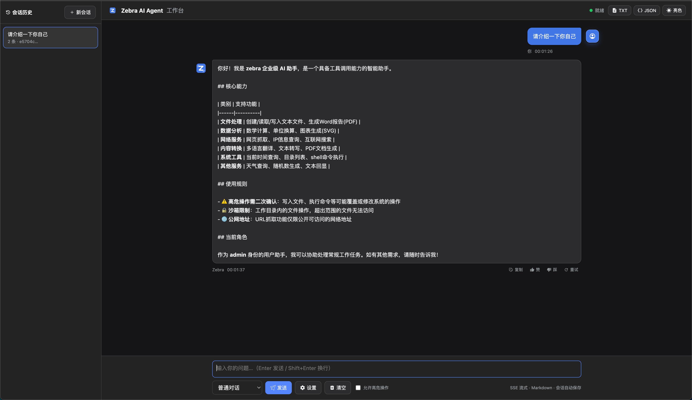
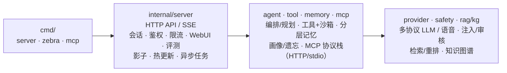

# Zebra AI Agent

[English](README.md) | **简体中文**

<p align="left">
 <a href="https://github.com/ericthz/zebra/actions/workflows/ci.yml"></a>
 
 
 
 
</p>

**用最小可读的纯 Go 代码，把 AI Agent 的每个技能点从零实现一遍 —— 看懂原理，而不只是会调 SDK。**

1. **纯 Go 标准库，零第三方运行时依赖**，不依赖任何框架/SDK，代码即原理。
2. **每个技能 = 最小可运行实现 + 详细中文注释（为什么/怎么做/生产演化方向）+ 单元测试 + 端到端验证**。
3. **以功能为单位提交**：一个功能一个 commit，每个技能的演进都可以通过 `git log` 逐一追溯。

> 注意：这不是一个可直接上线的产品，而是一张 **"技能 → 原理 → 代码" 的对照图**。

<p align="left"></p>
<p align="left"></p>
<p align="left"><em>Zebra Web 工作台（上）与 Zebra 终端 CLI（下）</em></p>

---

## 目录

- [1. 项目定位与阅读方式](#1-项目定位与阅读方式)
- [2. 快速开始](#2-快速开始)
- [3. 配置与环境变量](#3-配置与环境变量)
- [4. API 参考](#4-api-参考)
- [5. AI Agent 能力全景](#5-ai-agent-能力全景)
- [6. 架构设计](#6-架构设计)
- [7. 工程化与质量保障](#7-工程化与质量保障)
- [8. 许可证](#8-许可证)

## 1. 项目定位与阅读方式

### 1.1 定位

面向**想真正理解 AI Agent 原理**的开发者：不是"会用某个 SDK"，而是"知道 Agent 内部发生了什么、为什么这样设计、换一种做法会怎样"。

### 1.2 现状基线

| 维度 | 现状 |
|---|---|
| 代码规模 | 193 个 `.go` 文件（含 87 个测试文件），约 2.65 万行 |
| 包数量 | 3 个入口（`cmd/`）+ 27 个包（`internal/`）+ 评测用例（`test/eval/`） |
| 运行时依赖 | 零第三方，纯 Go 标准库 |
| 质量门禁 | `go build` / `go vet` 零警告，`go test ./...` 全绿；CI 工作流见 [7. 工程化与质量保障](#7-工程化与质量保障) |
| 覆盖范围 | AI Agent 主流技能点全覆盖（见 [5. AI Agent 能力全景](#5-ai-agent-能力全景)） |

### 1.3 阅读方式

> 想系统入门：按 [5. AI Agent 能力全景](#5-ai-agent-能力全景) 自上而下逐块读 ——
> 每个技能点先读"一句话原理"，再打开"代码入口"列的文件读头注释，最后改一处代码看行为。下面是被动浏览路径：

1. 从 [5. AI Agent 能力全景](#5-ai-agent-能力全景) 挑一个想学的技能点；
2. 打开"代码入口"列对应的文件，**先读文件头注释**（每段注释都按"为什么 → 怎么做 → 生产演化方向"组织）；
3. 跑对应包的测试，观察行为：`go test ./internal/<包>/ -v`；
4. 用 CLI / HTTP 端到端体验（见 [2. 快速开始](#2-快速开始)）；
5. 想系统过一遍：用 `git log --oneline` 按提交顺序逐个 `git show <commit>`，看每个技能"从零到一"的提交。

---

## 2. 快速开始

### 2.1 前置条件

- Go 1.26.5+（与 `go.mod` 声明一致；纯标准库，无第三方依赖）
- Ollama（本地 LLM 与嵌入，可选；也可用 OpenAI 兼容网关）

### 2.2 本地 CLI

```bash
ollama pull qwen3.5:0.8b-mlx
go run ./cmd/zebra
# 输入：北京今天天气怎么样？ → 观察工具调用、技能注入、RAG 检索的执行痕迹
# 多模态：go run ./cmd/zebra -image ./photo.png -image https://example.com/b.jpg
# 输入：这两张图是什么关系？ → 模型看到图片后回答（全模式可用）
```

CLI 与 server 使用**同一套装配逻辑**：自动加载 `.env`，配置了 `MCP_MODE` 则挂载
MCP 工具，配置了可用 `QDRANT_URL` 或 `REDIS_URL` 则启用长期记忆，加载 `docs/`
知识库；未就绪自动降级不阻断。诊断日志写入 `zebra.log`（`ZEBRA_LOG=off` 回退
stderr），终端只显示清单与对话。

Zebra CLI 与 Web UI 一样支持**多种对话模式**（`-mode` 启动参数或运行中
`/mode <名称>` 切换）：`chat` 普通对话、`plan` 规划-执行、`react` ReAct
推理-行动、`reflect` 反思改进、`debate` 双 Agent 辩论、`supervisor` 多 Agent
路由（数据/知识/常规三个专业 Worker）、`consistent` 自一致性采样择优（独立采样
多份回答再让模型选出最优，降低单次随机性，`SELF_CONSISTENT_SAMPLES` 可调采样数）。执行过程以终端活动轨迹展示：
`◇` 阶段（规划/执行步骤/思考/观察）、`▲` 工具调用（含成败）、`■` 技能注入，
与 Web UI 的活动轨迹块一一对应。`/help` 可查看全部命令。

### 2.3 HTTP 服务

```bash
export ADMIN_KEY=your-admin-key # 见 3.4 服务与安全；绑定 127.0.0.1 时可省略，取默认值
go run ./cmd/server
# 另开终端：
curl -X POST :8080/v1/chat \
 -H "Authorization: Bearer $ADMIN_KEY" \
 -H "Content-Type: application/json" \
 -d '{"message":"北京今天天气怎么样？","confirm_risky":true}'
```

server 的 JSON 日志**双写** stdout 与 `server.log`（`LOG_FILE` 可改，`LOG_FILE=off` 关闭落盘）。

### 2.4 一键起全套依赖

```bash
docker compose up --build
```

### 2.5 独立 MCP 服务器

```bash
make build # 产出 bin/zebra-mcp
go run ./cmd/mcp -http :9000 # HTTP 模式
# 或 stdio 模式：.env 配 MCP_MODE=stdio + MCP_COMMAND=bin/zebra-mcp
```

### 2.6 快速自检

```bash
go build ./... && go vet ./... && go test ./...
curl :8080/healthz # ok
curl :8080/readyz # ready
```

---

## 3. 配置与环境变量

全部配置通过环境变量注入；启动时自动加载工作目录下的 `.env`（真实环境变量优先，`.env` 只填充未设置的项）。
[`.env.example`](.env.example) 为填写模板，`/env` 命令（CLI 与 Web UI）可列出全部配置键的生效值与默认值，完整键表见 `internal/observe/env.go`。

### 3.1 模型与容错

| 变量 | 默认值 | 说明 |
|---|---|---|
| `OLLAMA_BASE_URL` / `OLLAMA_MODEL` | `http://localhost:11434` / `qwen3.5:0.8b-mlx` | 主模型（Ollama 原生，支持流式） |
| `FALLBACK_BASE_URL` / `FALLBACK_MODEL` | 空 | OpenAI 兼容备选模型（主模型故障降级） |
| `ANTHROPIC_API_KEY` / `ANTHROPIC_MODEL` / `ANTHROPIC_BASE_URL` | 空 | 可选 Anthropic 备选 |
| `OPENAI_API_KEY` / `OPENAI_BASE_URL` | 空 | OpenAI 兼容网关（备选/嵌入/语音共用） |
| `EMBED_MODEL` / `OPENAI_EMBED_MODEL` | `nomic-embed-text:v1.5` / `text-embedding-3-small` | 嵌入模型名 |
| `HTTP_TIMEOUT` | `60` | LLM 请求超时（秒） |
| `HTTP_RETRIES` / `HTTP_BACKOFF_MS` | `1` / `300` | 失败重试次数 / 退避基数（毫秒） |
| `CIRCUIT_THRESHOLD` / `CIRCUIT_COOLDOWN_SEC` | `5` / `30` | 熔断连续失败阈值 / 恢复冷却（秒） |

### 3.2 Agent 执行参数

| 变量 | 默认值 | 说明 |
|---|---|---|
| `REACT_MAX_STEPS` | `6` | ReAct 推理-行动最大步数（达到上限未收敛报错中止） |
| `SELF_CONSISTENT_SAMPLES` | `3` | 自一致性采样份数（`consistent` 模式） |
| `CONTEXT_MAX_TOKENS` | `4000` | 上下文窗口 token 预算（超出按滑动窗口裁剪） |
| `SUMMARY_MAX_CHARS` | `600` | 对话摘要最大字符数 |
| `MAX_TOOL_TURNS` | `5` | 最大工具调用轮数 |
| `ZEBRA_SUMMARIZER` | `truncate` | 摘要压缩器：`truncate`（截断）/ `llm`（LLM 语义压缩） |
| `ZEBRA_QUERY_REWRITE` | `0` | `1` 时启用 RAG 查询改写（提升检索命中） |

### 3.3 知识库与检索

| 变量 | 默认值 | 说明 |
|---|---|---|
| `RAG_CHUNK_SIZE` / `RAG_CHUNK_OVERLAP` | `600` / `100` | 文档分块大小 / 块间重叠（字符） |
| `ZEBRA_RAG_RERANK` | `0` | `1` 时启用检索后 LLM 重排 |

### 3.4 服务与安全

| 变量 | 默认值 | 说明 |
|---|---|---|
| `ADDR` | `:8080` | 服务监听地址。绑定非本机回环且未配置密钥时拒绝启动（防默认密钥暴露） |
| `ADMIN_KEY` / `USER_KEY` | `admin-key` / `user-key` | RBAC 两级 API Key。仅当绑定 127.0.0.1/localhost 时允许默认值，否则必须显式配置 |
| `ZEBRA_LOG` | `zebra.log` | Zebra CLI 诊断日志路径（`off`=stderr） |
| `LOG_FILE` | `server.log` | server 日志双写文件路径（`off`=仅 stdout） |
| `MCP_MODE` / `MCP_COMMAND` / `MCP_HTTP_URL` / `MCP_HTTP_TOKEN` | 空 | MCP 远端工具（stdio/http；stdio 建议指向预编译 `bin/zebra-mcp`；Token 设置即要求 Bearer） |
| `WEBHOOK_URL` / `WEBHOOK_SECRET` | 空 | Webhook 主动出站通知（HMAC 签名） |

### 3.5 本地执行沙箱

| 变量 | 默认值 | 说明 |
|---|---|---|
| `EXEC_WORKDIR` | `workspace` | 沙箱工作目录白名单 |
| `EXEC_READONLY` | `1` | 1=只读模式（禁止写文件/执行命令） |

### 3.6 语义缓存

| 变量 | 默认值 | 说明 |
|---|---|---|
| `CACHE_MAX_ENTRIES` | `200` | 语义缓存最大条目数 |
| `CACHE_THRESHOLD` | `0.92` | 语义缓存命中阈值（0~1） |

### 3.7 记忆与画像

| 变量 | 默认值 | 说明 |
|---|---|---|
| `QDRANT_URL` / `QDRANT_COLLECTION` | 空 / `zebra_mem` | 向量长期记忆（不可用自动降级） |
| `EMBED_VECTOR_SIZE` | `768` | 嵌入向量维度（须与嵌入模型匹配） |
| `REDIS_URL` / `REDIS_PASSWORD` / `REDIS_DB` | 空 / 空 / `0` | 会话/异步任务/长期记忆（无 Qdrant 时）水平扩展 |
| `PROFILE_TTL_HOURS` | `720` | 画像事实保鲜期（小时，默认 30 天） |
| `PROFILE_LLM` | `1` | 画像抽取：1=LLM+规则回退，0=纯规则 |
| `PROFILE_SWEEP_MINUTES` | `60` | 画像过期清扫周期（分钟） |

### 3.8 评测与影子

| 变量 | 默认值 | 说明 |
|---|---|---|
| `EVAL_CASES_DIR` | `test/eval/cases` | 离线评测用例目录（反馈回流写入此处） |
| `ZEBRA_SHADOW_MODEL` | 空 | 影子评测候选模型（设置即开启） |
| `ZEBRA_SHADOW_OPENAI` / `ZEBRA_SHADOW_BASE_URL` | `0` / 空 | 候选走 OpenAI 兼容后端 / 候选网关地址 |
| `ZEBRA_SHADOW_SAMPLE` / `SHADOW_STORE_MAX` | `10` / `200` | 自动采样率百分比（0=仅显式触发） / 记录上限 |
| `JUDGE_BASE_URL` / `JUDGE_OPENAI` / `JUDGE_MODEL` / `JUDGE_API_KEY` | 空 / `0` / 空 / 空 | 独立评审模型；全空则复用生产 router |

### 3.9 语音

| 变量 | 默认值 | 说明 |
|---|---|---|
| `VOICE_BASE_URL` / `VOICE_API_KEY` | 空 | OpenAI 兼容语音网关（设置即开启 ASR/TTS） |
| `VOICE_ASR_MODEL` / `VOICE_TTS_MODEL` | `whisper-1` / `tts-1` | 转写 / 合成模型 |
| `VOICE_TONE` | `alloy` | 合成音色 |

> 颜色输出遵循 `NO_COLOR` 约定：设置 `NO_COLOR` 或 `TERM=dumb`、或输出非 TTY（管道/重定向/CI）时自动关闭。

---

## 4. API 参考

### 4.1 端点一览

| 方法 | 路径 | 说明 | 鉴权 |
|---|---|---|---|
| POST | `/v1/chat` | 非流式对话（`mode`: `plan` / `supervisor` / `reflect` / `react` / `debate` / `consistent`） | 用户 |
| POST | `/v1/chat/stream` | SSE 流式对话 | 用户 |
| DELETE | `/v1/user/data` | 被遗忘权：删除当前用户全链路数据 | 用户 |
| GET | `/v1/user/profile` | 查看画像事实 + 冲突记录 | 用户 |
| POST | `/v1/user/profile/forget` | 删除一条画像事实 | 用户 |
| POST | `/v1/user/profile/resolve` | 裁决画像冲突（`keep: old/new`） | 用户 |
| POST | `/v1/tasks` | 提交异步长任务（立即返回 id） | 用户 |
| GET | `/v1/tasks` | 任务列表 | 用户 |
| GET | `/v1/tasks/{id}` | 任务详情/进度/检查点 | 用户 |
| POST | `/v1/feedback` | 提交反馈（赞/踩 + 评论；踩自动回流评测集） | 用户 |
| GET | `/v1/feedback` | 我的反馈列表 + 正负计数 | 用户 |
| GET | `/v1/knowledge` | 知识图谱查询（`?entity=xxx`） | 用户 |
| POST | `/v1/admin/reload` | 热更新技能/提示词/知识库/插件 | admin |
| POST | `/v1/eval/shadow` | 触发一次影子评测（同步返回对比结论） | admin |
| GET | `/v1/eval/shadow` | 影子评测记录 | admin |
| GET | `/v1/eval/shadow/stats` | 影子看板 + 灰度切换建议 | admin |
| POST | `/v1/eval/shadow/promote` | 候选模型提升为主模型（质量回退自动切回） | admin |
| POST | `/v1/voice/chat` | 语音对话全链路（音频→文本→Agent→音频 base64） | 用户 |
| POST | `/v1/voice/transcribe` | 语音转写（multipart 上传） | 用户 |
| POST | `/v1/voice/synthesize` | 文本合成语音 | 用户 |
| GET | `/healthz` `/readyz` | 存活/就绪探针 | 免鉴权 |
| GET | `/metrics` | Prometheus 指标 | 免鉴权 |
| GET | `/metrics/cost` | 成本归因（含 per-user/per-session 明细） | admin |
| GET | `/favicon.svg` | 站点图标 | 免鉴权 |
| GET | `/` | 零构建 Web UI（SSE 聊天） | 免鉴权 |

### 4.2 对话示例

> 下列示例用 `$ADMIN_KEY` / `$USER_KEY` 指代 [3.4 服务与安全](#34-服务与安全) 的两个 API Key；本机演示绑定 127.0.0.1 且未配置时，取默认值 `admin-key` / `user-key`。

```bash
# 普通对话（user 角色仅开放部分工具）
curl -X POST :8080/v1/chat \
 -H "Authorization: Bearer $USER_KEY" -H "Content-Type: application/json" \
 -d '{"message":"计算 12*8 等于多少？"}'

# 流式对话（SSE）
curl -N -X POST :8080/v1/chat/stream \
 -H "Authorization: Bearer $ADMIN_KEY" -H "Content-Type: application/json" \
 -d '{"message":"讲讲北京和上海的天气","stream":true}'

# 多轮：先建会话拿 session_id，再续接
curl -X POST :8080/v1/chat \
 -H "Authorization: Bearer $ADMIN_KEY" -H "Content-Type: application/json" \
 -d '{"message":"我的名字叫小明"}'
curl -X POST :8080/v1/chat \
 -H "Authorization: Bearer $ADMIN_KEY" -H "Content-Type: application/json" \
 -d '{"session_id":"<上一步返回>","message":"我叫什么名字？"}'
```

### 4.3 高级能力示例

```bash
# 六种推理模式（plan / supervisor / reflect / react / debate / consistent）
curl -X POST :8080/v1/chat -H "Authorization: Bearer $ADMIN_KEY" -H "Content-Type: application/json" \
 -d '{"message":"计算 (23+19)*5 并告诉我今天日期","mode":"plan"}'
curl -X POST :8080/v1/chat -H "Authorization: Bearer $ADMIN_KEY" -H "Content-Type: application/json" \
 -d '{"message":"北京天气怎么样？","mode":"react"}'
curl -X POST :8080/v1/chat -H "Authorization: Bearer $ADMIN_KEY" -H "Content-Type: application/json" \
 -d '{"message":"北京天气怎么样？","mode":"consistent"}'

# 影子评测看板 / 切换 / 自动回滚（仅 admin）
curl :8080/v1/eval/shadow/stats -H "Authorization: Bearer $ADMIN_KEY"
curl -X POST :8080/v1/eval/shadow/promote -H "Authorization: Bearer $ADMIN_KEY"

# 知识图谱：按实体反查关系
curl ":8080/v1/knowledge?entity=工具调用" -H "Authorization: Bearer $USER_KEY"

# 语音对话（multipart file = 音频）
curl -X POST :8080/v1/voice/chat -H "Authorization: Bearer $USER_KEY" -F "file=@voice.wav"

# 多模态：附图片提问（images 支持 http(s) URL / data: 数据 URI）
curl -X POST :8080/v1/chat -H "Authorization: Bearer $USER_KEY" -H "Content-Type: application/json" \
 -d '{"message":"这张图里有什么？","images":["https://example.com/photo.png"]}'

# 画像：查看 / 精细遗忘 / 冲突裁决
curl :8080/v1/user/profile -H "Authorization: Bearer $USER_KEY"
curl -X POST :8080/v1/user/profile/resolve -H "Authorization: Bearer $USER_KEY" \
 -d '{"key":"name","keep":"old"}'
```

**鉴权与限流体验**：不带 `Authorization` → 401；高频调用 → 429；
`user` 角色调用 `web_search` → 工具执行错误（白名单收回权限）。

---

## 5. AI Agent 能力全景

> 这张表是本仓库的核心：**技能点 → 代码入口 → 一句话原理**。
> 按能力域组织，覆盖工程化落地的四类能力：**服务化与访问**、**可靠性工程**、**Agent 能力补全**、**安全与合规**；工程化与测试类见 [7. 工程化与质量保障](#7-工程化与质量保障)。
> 每个入口文件的头注释都是该技能的"原理讲义"。

### 5.1 对话与推理

| 技能点 | 代码入口 | 一句话原理 |
|---|---|---|
| 工具调用循环 | `internal/agent/agent.go` | 模型返回工具请求 → 执行 → 结果回填 → 再调，直到输出纯文本 |
| 并行工具调用 | `internal/agent/agent.go` | 同轮互不依赖的工具并发执行，按调用顺序回填不失序 |
| 参数纠错 / 循环检测 | `internal/agent/agent.go` | 参数解析失败反馈重试；连续相同调用判定死循环并中止 |
| 规划-执行 | `internal/agent/plan.go` | 先拆解为步骤（JSON）再逐步执行，子步骤不写历史 |
| ReAct 轨迹 | `internal/agent/react.go` | 每步输出 思考/行动/答案 三元组，工具观察回填后继续 |
| 反思 | `internal/agent/reflect.go` | 生成后让模型批判-改进，失败回退原文 |
| 自一致性 | `internal/agent/reflect.go` | 独立采样多份回答再择优，降低单次随机性 |
| 多 Agent Supervisor | `internal/supervisor/` | LLM 路由 + 关键词兜底，专业 Worker 各司其职 |
| 多 Agent 辩论 | `internal/agent/debate.go` | 双立场独立作答 → 交换观点 → 评审选优 |
| 结构化输出强约束 | `internal/schema/` `internal/provider/structured.go` | 生成前 response_format + 生成后 schema 校验，双保险 |

### 5.2 记忆与上下文

| 技能点 | 代码入口 | 一句话原理 |
|---|---|---|
| 分层记忆 | `internal/memory/` | 工作记忆（会话内）+ 长期记忆（向量/Redis）按层检索 |
| 用户画像 | `internal/memory/profile.go` | 规则/LLM 从对话抽取事实，按置信度合并去重 |
| 遗忘机制 | `internal/memory/forget.go` | TTL 保鲜 + 容量裁剪 + 被遗忘权，记忆"只进不出"是缺陷 |
| 画像冲突消解 | `internal/memory/profile.go` | 同 key 异值记录冲突、可裁决回退，不静默覆盖 |
| 上下文工程 | `internal/agent/context.go` | token 估算 + 滑动窗口裁剪 + 摘要器接口 |
| LLM 摘要压缩 | `internal/agent/summarize.go` | 旧对话语义压缩为 system 摘要，长对话控 token 保语义 |
| 查询改写 | `internal/agent/rewrite.go` | 结构化改写问题（补全指代），提升检索与回答质量 |

### 5.3 知识与 RAG

| 技能点 | 代码入口 | 一句话原理 |
|---|---|---|
| 分块 / 向量索引 | `internal/rag/` | 文档 → 分块 → 嵌入 → 余弦相似度检索 |
| BM25 混合检索 | `internal/rag/bm25.go` | 关键词精确命中与向量语义互补，z-score 归一融合 |
| LLM 重排 | `internal/rag/rerank.go` | 对 topK 候选片段二次打相关分，失败回退原序 |
| 引用溯源 | `internal/rag/index.go` `internal/agent/agent.go` | 命中片段带【来源】标记注入，回答可引用、防幻觉 |
| 知识图谱 | `internal/kg/` | 三元组（实体-关系-实体）规则抽取 + 按实体反查 |

### 5.4 工具生态

| 技能点 | 代码入口 | 一句话原理 |
|---|---|---|
| 内置工具 | `internal/tool/builtin.go` | 计算/搜索/翻译/IP 等，JSON Schema 描述入参 |
| 本地执行沙箱 | `internal/tool/exec*.go` | 目录白名单 + 只读模式 + 超时/输出截断 |
| 命令沙箱 | `internal/tool/exec_shell.go` | 命令黑名单 + 超时强杀 + 输出截断 |
| 文档产出 | `internal/docgen/` | docx（zip+OOXML）/ PDF / SVG 图表，零依赖生成 |
| 网络抓取 | `internal/tool/fetch.go` | SSRF 防护（协议/内网/域名白名单）后抓取文本 |
| MCP 协议栈 | `internal/mcp/` | JSON-RPC 2.0，stdio/HTTP 双传输，握手/工具/调用 |
| 插件动态加载 | `internal/plugin/` | JSON 定义 HTTP 工具，运行时注册、热重载可卸载 |

### 5.5 技能与提示词

| 技能点 | 代码入口 | 一句话原理 |
|---|---|---|
| Skill 技能包 | `internal/skill/` `skills/` | SKILL.md 元数据 + 程序性指令，检索命中才注入（懒加载） |
| Prompt 管理 | `internal/prompt/prompt.go` | 模板版本化 + 灰度切换 + 文件化热更新 |

### 5.6 模型接入与容错

| 技能点 | 代码入口 | 一句话原理 |
|---|---|---|
| 流式输出 | `internal/provider/` `internal/agent/stream.go` | Ollama / OpenAI 真流式，Anthropic 自动回退；SSE 逐字推送 |
| 多模型路由 | `internal/provider/router.go` | 顺序 fallback + `Promote` 灰度提升，质量回退自动切回原主 |
| 熔断 / 降级 / 容错 | `internal/provider/http.go` `internal/provider/router.go` | 失败重试 → 熔断冷却；依赖不可用自动降级，不阻断对话 |
| 错误恢复 | `internal/server/middleware.go` `internal/agent/agent.go` | panic 兜底 + `ctx` 可取消；落库失败不阻塞对话 |

### 5.7 评测与质量

| 技能点 | 代码入口 | 一句话原理 |
|---|---|---|
| LLM-as-Judge | `internal/eval/judge.go` | 忠实/相关/安全三维打分，结构化输出（安全语义：拒绝=安全，只有实际泄露/提供危险内容才低分） |
| 评测数据集管理 | `internal/eval/dataset.go` | 用例目录化 + 批量跑分 + BaselineDiff 回归对比 |
| 红队评测 | `test/eval/cases/redteam.json` | 注入/越狱用例 + 安全分门槛，防能力退化 |
| 反馈回流 | `internal/eval/dataset.go` `internal/server/feedback.go` | 用户"踩"→ 问答对自动进数据集，纳入回归 |
| 影子模式 | `internal/eval/shadow.go` | 候选模型同题独立回答，Judge 双评对比 |
| 金丝雀切换/自动回滚 | `internal/eval/stats.go` `internal/server/shadow.go` | 胜率达标 promote；质量回退自动切回原主 |

### 5.8 安全与合规

| 技能点 | 代码入口 | 一句话原理 |
|---|---|---|
| Prompt 注入防护 | `internal/safety/safety.go` | 工具结果强制隔离标记 + 注入特征检测 |
| 内容审核 | `internal/safety/safety.go` | 输入/输出双端 Moderator 接口 |
| 敏感数据脱敏 | `internal/safety/safety.go` | 日志/审计强制 Redact |
| SSRF 防护 | `internal/safety/ssrf.go` | 协议 / 内网 / 域名三重白名单 |
| 审计 + 高危二次确认 | `internal/safety/audit.go` `internal/tool/registry.go` | 全量留痕；高危工具人工确认 |
| 被遗忘权 / 租户隔离 | `internal/server/forget.go` `internal/memory/` | 删除用户全链路数据；记忆按租户分 collection/key |

### 5.9 可观测与运营

| 技能点 | 代码入口 | 一句话原理 |
|---|---|---|
| 结构化日志 | `cmd/zebra` `cmd/server` | CLI 落文件 / server stdout+文件双写 |
| 指标 | `internal/server/health.go` | Prometheus 文本格式计数器/直方图 |
| 健康检查 / 优雅停机 | `internal/server/health.go` `internal/server/server.go` | `/healthz` `/readyz` 探针；信号触发平滑退出 |
| 启动清单 / banner / 执行痕迹 | `internal/observe/` `internal/console/` | 资产盘点、ASCII 标题、工具/技能调用痕迹 |
| 成本归因 | `internal/cost/` | 按 用户×会话×模型 估算 token 成本 |
| 语义缓存 | `internal/cache/` | 相似问题命中直接返回答案，跳过模型调用 |
| 热更新 | `internal/server/reload.go` | 技能/提示词/知识库/插件不重启重载 |
| 反馈闭环 | `internal/feedback/` | 赞踩 + 指标 + 审计 + 回流评测 |

### 5.10 规模化与体验

| 技能点 | 代码入口 | 一句话原理 |
|---|---|---|
| HTTP / SSE / Web UI | `internal/server/` | JSON、SSE 流式、零构建前端三形态 |
| 会话管理 | `internal/server/session.go` `redis_session.go` | TTL + Touch，内存/Redis 可插拔 |
| 异步任务 | `internal/task/` | 状态机 + 消费者队列 + 检查点，内存/Redis |
| 水平扩展骨架 | `internal/redis/` | 手写 RESP 客户端；会话/任务/记忆均可迁 Redis |
| 认证鉴权 / RBAC | `internal/server/auth.go` `internal/server/middleware.go` | Bearer API Key + admin/user 两级角色，工具按角色白名单开放 |
| 限流与配额 | `internal/server/auth.go` | 按用户令牌桶限流，超限 429 拒绝 |
| CLI 行编辑 | `internal/console/readline.go` | raw 模式 + UTF-8 感知退格（中文不再卡） |
| 语音交互 | `internal/provider/voice.go` | OpenAI 兼容 ASR/TTS 全链路 |
| 多模态输入 | `internal/agent/agent.go` `internal/server/chat.go` | `images` 字段 → text+image_url 内容块，HTTP/CLI 双入口全模式可用 |

---

## 6. 架构设计

### 6.1 架构总览

数据流：**入口 → 服务层 → 编排层 → 能力层**，同级之间只通过接口依赖。



- **入口层** `cmd/`：只做装配（组装依赖、注册工具与路由），不含业务逻辑。
- **服务层** `internal/server/`：把能力暴露为 HTTP/SSE，并统一挂载鉴权、限流、审计等横切关注点。
- **编排层** `agent / tool / memory / mcp`：决定"这一轮怎么想、能调用什么、记住什么"。
- **能力层** `provider / safety / rag / kg`：模型协议、内容安全、检索与知识图谱等可替换的实现细节。

### 6.2 设计原则

- **分层依赖倒置（Layered Dependency Inversion）**：下层不依赖上层，上层通过接口依赖下层；装配只发生在入口，每个组件可替换。
- **接口驱动（Interface-Driven Design）**：`SessionStore`、`Memory`、`Summarizer`、`Moderator`、`Embedder`、`Extractor`、`Reranker` 等均为接口，生产实现方向写在注释里。
- **横切集中（Cross-cutting Concerns）**：鉴权、限流、日志、恢复、审计作为中间件/回调统一挂载，业务代码不感知。

### 6.3 目录结构

```
├── cmd/ 3 个入口（server / zebra / mcp）
├── internal/
│ ├── agent/ 编排：工具循环/规划/ReAct/反思/辩论/上下文/画像注入
│ ├── provider/ LLM 多协议 + 路由/熔断/重试 + 结构化输出 + 语音
│ ├── tool/ 工具 + 权限 + 校验 + 审计 + 本地沙箱 + 文档/插件工具
│ ├── memory/ 分层记忆 + 画像 + 遗忘/冲突 + 规则/LLM 抽取 + Redis 记忆
│ ├── docgen/ Word / PDF / SVG 图表产出（零依赖）
│ ├── rag/ 分块 + BM25/向量混合检索 + LLM 重排
│ ├── kg/ 知识图谱（三元组抽取/查询）
│ ├── eval/ Judge + 数据集 + 红队 + 影子评测 + 金丝雀
│ ├── plugin/ 插件动态加载（JSON 定义 HTTP 工具）
│ ├── redis/ 纯标准库 RESP 客户端
│ ├── redistest/ 假 Redis 测试服务器（多包共用）
│ ├── config/ 零依赖 .env 加载 + 日志文件
│ ├── observe/ 启动清单共享渲染 + banner
│ ├── console/ 终端排版/配色/raw 行编辑
│ ├── mcp/ MCP 协议栈（客户端/服务端/stdio/HTTP）
│ ├── server/ HTTP API + 会话 + 鉴权 + 限流 + Web UI + 运维端点
│ ├── safety/ 注入防护 + 审核 + 脱敏 + SSRF + 审计
│ ├── prompt/ 模板版本化 + 热更新
│ ├── feedback/ 反馈闭环
│ ├── task/ 异步长任务 + 检查点（内存/Redis）
│ ├── supervisor/ 多 Agent 路由
│ ├── skill/ 技能包加载：SKILL.md 解析 + 检索命中注入（懒加载）
│ └── notify/ schedule/ cost/ cache/ schema/ 出站/调度/成本/缓存/校验
├── skills/ 技能包示例（SKILL.md）
├── prompts/ 文件化提示词模板（热更新）
├── plugins/ 插件示例（JSON）
├── docs/ RAG 语料目录（顶层 *.md / *.txt）+ 配图 images/
├── test/eval/ LLM 评测骨架 + 用例集（golden / redteam；feedback 用例由运行时回流生成）
├── workspace/ 本地执行沙箱工作目录
└── Dockerfile / docker-compose.yml / Makefile / .github/workflows/ci.yml
```

---

## 7. 工程化与质量保障

- **单元测试**：87 个测试文件（`internal/` 84 + `test/eval/` 2 + `cmd/` 1），`go test ./...` 全绿；每个新增功能强制配套测试。
- **静态检查**：`go vet ./...` 零警告；提交前 `gofmt` 全量格式化。
- **LLM 评测**：`test/eval/` 含 golden 回归与红队评测（`ZEBRA_EVAL=1` 开启真实模型）。
- **容器化与 CI**：Docker 多阶段构建 + distroless；GitHub Actions 工作流含 build + vet + test。
- **端到端验证**：每项能力以"真实运行 + 断言"收尾（如影子 verdict、语音音频回传、Redis 续期、冲突裁决回退）。

### 7.1 关键问题修复

> 修复真实缺陷、堵住安全/租户边界、恢复多轮上下文连续性；所有修复均不引入第三方依赖，保持零依赖教学定位。

| 技术点 | 问题 | 修复 | 代码入口 |
|---|---|---|---|
| 结构化输出强约束 | schema `required` 混用 `[]string`/`[]interface{}`，`[]string` 声明的必填字段被静默跳过 | 归一化两种类型，必填校验对全部 schema 生效 | `internal/schema/validator.go` `internal/tool/tool.go` |
| 流式工具调用 | OpenAI 兼容网关按 index 分片下发工具调用，分片被当作完整调用 → 参数残缺/重复条目 | 按 index 累加 id/name/arguments，流结束一次性发出完整调用 | `internal/provider/openai.go` |
| 多模型路由 | `Promote`（影子灰度）与 `Chain`/`ChatWithFallback` 并发读写切片 → 数据竞争 | 锁内取候选链快照再遍历 | `internal/provider/router.go` |
| 健康探针 | `readyz` 的 `llm` 与 `tools` 两个探针都映射到工具检查 | 新增 `llmReadyCheck`（校验主模型路由就绪） | `internal/server/server.go` |
| 语义缓存 + 租户隔离 | 缓存键无租户维度 → 跨用户答案互命；命中早退绕过审核/记忆 | `Get`/`Put` 增加 user scope 命名空间；命中仍做输出审核 + 写历史/记忆 | `internal/cache/cache.go` `internal/agent/agent.go` |
| 主动出站 | 幂等键在重试循环内用时间戳生成，重试时变化 → 接收方去重失效 | 幂等键在循环外由事件 body 哈希派生，所有重试携带同一键 | `internal/notify/notify.go` |
| SSRF 防护 | `fetch_url` 302 重定向可绕过初始校验；插件 URL 无 SSRF | `CheckRedirect` 逐跳再校验；插件 `Execute` 加 SSRF + `AllowHosts` 白名单 | `internal/tool/fetch.go` `internal/plugin/plugin.go` |
| ReAct 轨迹 | 模型看不到工具清单，只能猜工具名 | 系统提示注入当前角色可见工具 schema（名称/描述/参数） | `internal/agent/react.go` |
| 规划-执行 / ReAct / 辩论 | 三种模式不写历史与记忆 → 多轮上下文断裂 | 新增 `rememberTurn`：只写"问题→最终答案"一轮，子步骤不污染 | `internal/agent/agent.go` `plan.go` `react.go` `debate.go` |
| RAG 混合检索 / Redis 长期记忆 | BM25 空语料 `avgLen=0` 除零出 NaN；Redis 读改写并发写互相覆盖 | BM25 分母兜底 + NaN 防护；Redis `Store` 加进程内互斥 | `internal/rag/bm25.go` `internal/memory/redis_mem.go` |

**启动清单符号说明**（Zebra CLI 与 server 启动时打印的能力清单，TTY 下按类别着色）：

| 符号 | 类别 | 颜色（TTY） |
|---|---|---|
| ── | 标题分隔（Title） | 浅灰 |
| ◆ | 模型（Model） | 天蓝 |
| ▲ | 工具（Tool） | 橙 |
| ■ | 技能（Skill） | 粉/品红 |
| ● | MCP（Model Context Protocol） | 绿 |
| ▣ | 记忆（Memory） | 紫 |
| ▤ | 知识库（RAG Knowledge Base） | 青 |
| ♪ | 语音（Voice：ASR / TTS） | 金 |
| ◐ | 影子评测（Shadow Evaluation） | 深灰 |
| ◎ | Redis（会话存储） | 红 |

> 颜色仅在 TTY 且未设置 `NO_COLOR` 时输出（256 色 ANSI，零宽度、不影响对齐）；管道/重定向/CI 自动无色。

示例（server）：

```
── Zebra 启动清单
├── ◆ 模型 : ollama
├── ▲ 工具 : 16 个
│ ├─ calculator : 计算数学表达式
│ ├─ convert_units: 单位换算
│ └─ ...
├── ● MCP : 未启用（MCP_MODE 未设置）
├── ■ 技能 : 2 个
│ ├─ data-check : 当用户要求核对数据...时使用
│ └─ report-sop : 当用户要求撰写研究报告...时使用
├── ▣ 记忆 : 工作记忆
├── ▤ 知识库 : 0 篇文档 / 0 块
├── ♪ 语音 : 已启用（ASR/TTS）
├── ◐ 影子评测 : 未启用（ZEBRA_SHADOW_MODEL 未设置）
└── ◎ Redis : 未启用（内存会话，单机）
```

---

## 8. 许可证

[Apache License 2.0](LICENSE)
